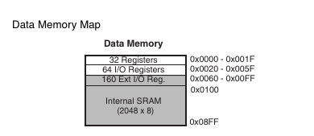
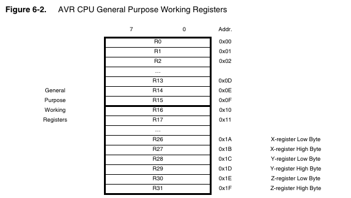
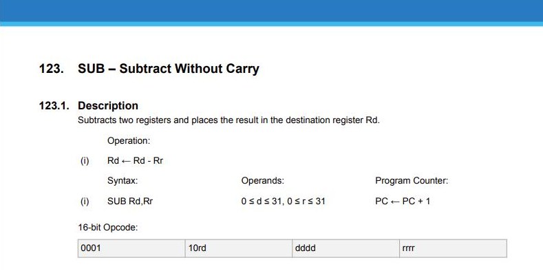

# MVP

1. Emulation of AVR CPU to run simple program and 7then to emulate first microcontroller chip - ATmega328p
	- Emulation of memory and memory addressing system for RAM FLASH AND EEPROM It's worth to mention that the AVR cpu is build based on Harvad architecture and it's little endian
	- Implementation of basic cpu registers in memory address space 

		
		
		
		_Images from ATMega328P datasheet_
	- Implementing instructions (page 330 of documentation)
		- Create a clear and universal way to implement instructions
		- All few hundred instructions need to be implemented
		- Every instuction MUST HAVE its unit test
	- Initialization procedure
	- Reset procedure
	- Implementation of basic IO registers (PORTx, PINx, DDRx)
	- Basic clock implementation
	- All modules of chip must have unit tests (especially instructions)
	
2. Chip interfacing 	
	- Universal Implementation of loading whole program from bin or hex file (ProgramLoader or something) 
	- Serializing of chip image snapshot or transmitting Chip image in real time. Something like pseudo code below
	``` C++
		BaseChipSerializer* serializer = chip.CreateSerializer();
		JsonObject obj = serializer.Serialize();
	```
	- We should be able also restore chip state from serialized snapshot
	- Simple QT interface in Sandbox project to debug app and create demos
	- Create EmulationEngine which will provide resources that emulation needs. Will run emultion on separate thread to provide maximum performance minimize delays caused by operations in main thread like chip data serializing
	``` C++
		ALinkEmu::EmulationEngine engine;
		// Still not sure how chip creating process will finally look.
		// Maybe using ALinkEmu::ChipRef = std::shared_ptr<BaseChip>?
		std::shared_ptr<BasicChip> chip = ALinkEmu::CreateChip("ATmega328P");
		engine.AttachChip(chip);
		engine.StartMultithreadedEmulation();

		// Add infinite loop or do other tasks to not stop main thread.
	```


3. Utils universal for each platform
	- BasicChip Interface
		``` C++
			class BasicChip {
			 public:
				virtual void Start() = 0;
				virtual void Reset() = 0;
				virtual void Run() = 0;
				virtual void LoadFlashImage(FlashImageRef image) = 0;
			 private:
				virtual void DecodeAndExecute(BasicOpcode& op) = 0;

			};
		```
	- FlashImage and FlashImageRef
		``` C++
			// For now it will be alias but in the future 
			// Some binary image parsing functionalities will be added
			// Like Getters for sections or symbols if needed
			using FlashImage = std::vector<uint8_t>;
			using FlashImageRef = std::shared_ptr<FlashImage>;	
		```
	- FlashImageLoader class
		``` C++
			// Could be static but it's object weights only 1 byte and 
			// stack allocation takes no time.
			class FlashImageLoader {
			 public:
				FlashImageRef LoadFromStream(std::istream& stream);
				FlashImageRef LoadFromFile(const std::string& fileName);
				FlashImageRef LoadFromBuffer(const uint8_t* data, size_t len);
				FlashImageRef LoadFromBuffer(const std::vector<uint8_t>& data);
			};
		```
	- Instruction handling
		http://ww1.microchip.com/downloads/en/devicedoc/atmel-0856-avr-instruction-set-manual.pdf
		- Instruction has following data: 
			- An part of opcode which defines particular instrucion
			- Count of clock cycles it takes
			- A handling procedure
		- Instructions and it's parameteres are merged into 16 or 32 bit opcodes which uC decodes in the following way:
		
		It may seem unclear by looking on this schematic so I prepared little explanation with example
		```
			Lets say we have following code:
			- sub r24, r25
			      ^Rd  ^Rr
			which will be assembled into following opcode:
			- 89 1b
			Which is 0x1b96 (because of little endian architecture)
			In binary it equals
			0001 1011 1000 1001
			Where looking from the left side 0001 10 is the part which
			defines the sub instruction.

			The second part defines addresses of r24 and r25 registers
			This is kinda tricky.

			Address of r25 is simply 25 -> 0b11001
			And address of r24 is 24 -> 0b11000
			The rest of opcode is 11 1000 1001
			Looking from the left first 1 is the MSB of r25 address
			Second 1 is the MSB of r24 address
			1000 is the rest of r24 address
			1001 is the rest of r25 address

			Source: https://www.avrfreaks.net/forum/how-can-i-understand-what-opcode-reading-instruction-set
		```


